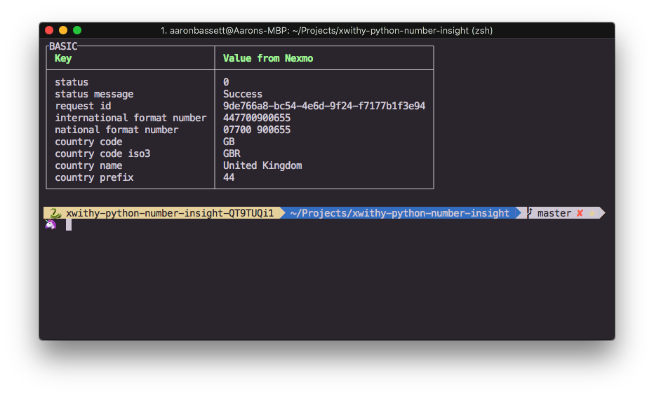
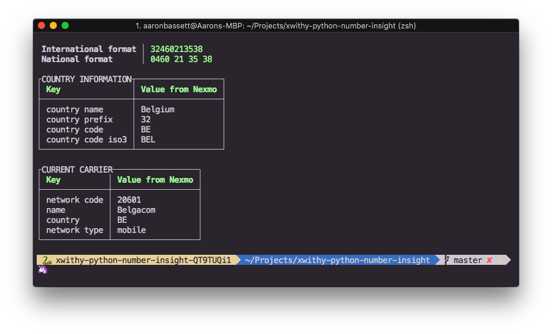
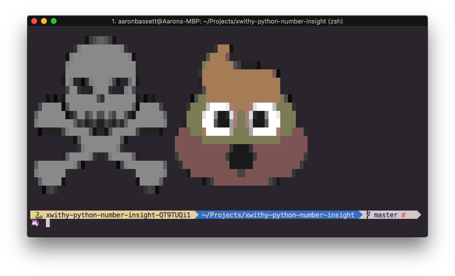

# Formatting, validating, and investigating numbers with Nexmo number insight

## ❗❗❗ **This repo is now deprecated. Check the [Vonage Developer Blog](https://developer.vonage.com/en/blog) for more blog posts and tutorials. For more sample Vonage projects, check the [Vonage Community GitHub repo](https://github.com/Vonage-Community).**

For more details about this example code, and many others, please check the [Nexmo blog](https://www.nexmo.com/blog/category/developer/).

## Quick start

All examples have been tested with Python 3.6. Dependencies are managed via [pipenv](http://pipenv.readthedocs.io/en/latest/)

    # add your Nexmo API key and secret to the .env file
    cp .env.example .env
    vim .env

    # install all requirements
    pipenv install

    # enter your venv
    pipenv shell

    # run the different scripts
    python basic.py 447700900655
    python standard.py 447700900655
    python advanced.py 447700900655 127.0.0.1

## Examples

